# 第1章-浏览器生成消息——探索浏览器内部

[TOC]

## 1.1 生成HTTP请求消息

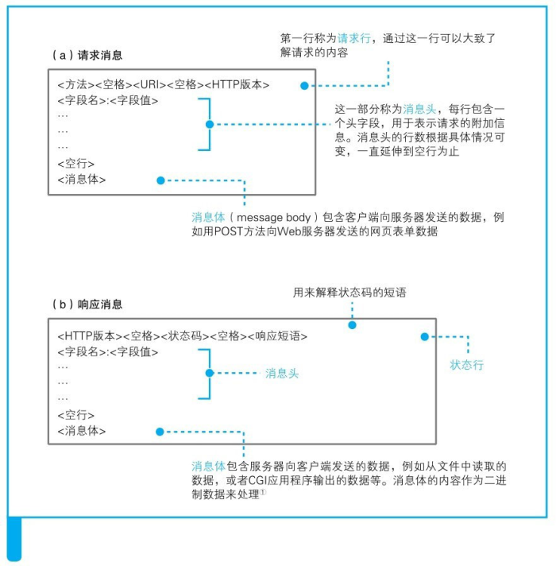

## 1.2 向DNS服务器查询Web服务器的IP地址
### 1.2.1 IP地址的基本知识
TCP/IP的结构如图所示，就是由一些小的子网，通过路由器连接起来组成一个大的网络。
这里的子网可以理解为用集线器连接起来的几台计算机，我们将它看作一个单位，称为子网。将子网通过路由器连接起来，就形成了一个网络。

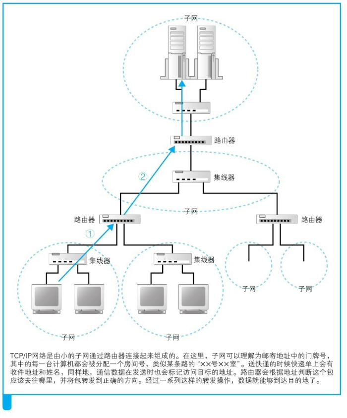

在网络中，所有的设备都会被分配一个地址。这个地址就相当于现实中某条路上的“××号××室”。

其中“号”对应的号码是分配给整个子网的，而“室”对应的号码是分配给子网中的计算机的，这就是网络中的地址。

“号”对应的号码称为网络号，“室”对应的号码称为主机号，这个地址的整体称为IP地址。

发送者发出的消息首先经过子网中的集线器，转发到距离发送者最近的路由器上。

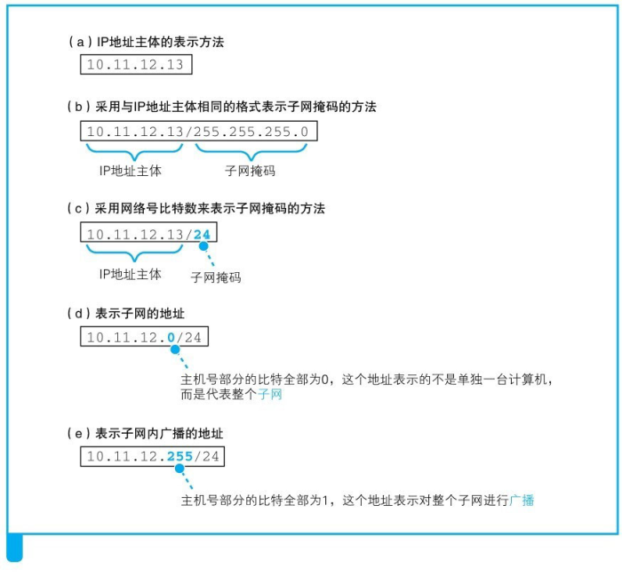

IP地址是一串32比特的数字，按照8比特（1字节）为一组分成4组，分别用十进制表示然后再用圆点隔开。

在IP地址的规则中，网络号和主机号连起来总共是32比特，但这两部分的具体结构是不固定的。
在组建网络时，用户可以自行决定它们之间的分配关系，因此，还需要另外的附加信息来表示IP地址的内部结构。

这一附加信息称为子网掩码。子网掩码的格式如图②所示，是一串与IP地址长度相同的32比特数字，其左边一半都是1，右边一半都是0。

其中，子网掩码为1的部分表示网络号，子网掩码为0的部分表示主机号。

主机号部分全部为0代表整个子网而不是子网中的某台设备（（d））。此外，主机号部分全部为1代表向子网上所有设备发送包，即广播（图（e））。

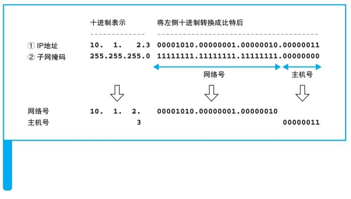

### 1.2.2 域名和IP地址并用的理由
让人来使用名称，让路由器来使用IP地址。

需要有一个机制能够通过名称来查询IP地址，或者通过IP地址来查询名称，这个机制就是DNS。

### 1.2.3 -1.2.5 DNS
向DNS服务器发出查询，也就是向DNS服务器发送查询消息，并接收服务器返回的响应消息。

对于DNS服务器，我们的计算机上一定有相应的DNS客户端，而相当于DNS客户端的部分称为DNS解析器，或者简称解析器。

通过DNS查询IP地址的操作称为域名解析，因此负责执行解析（resolution）这一操作的就叫解析器（resolver）了。

根据域名查询IP地址时，浏览器会使用Socket库中的解析器。

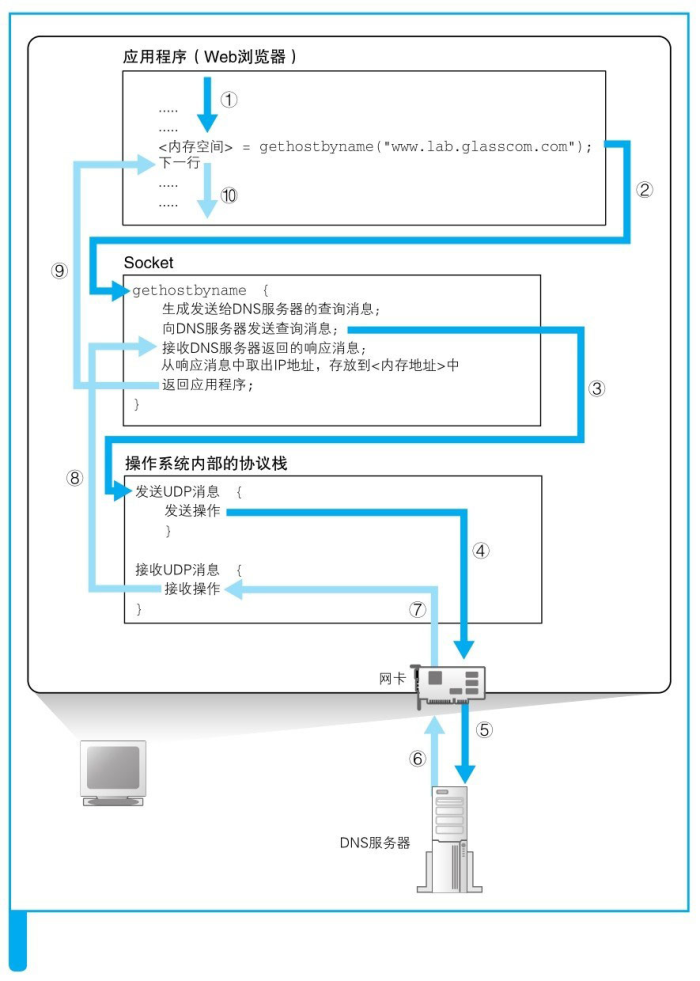

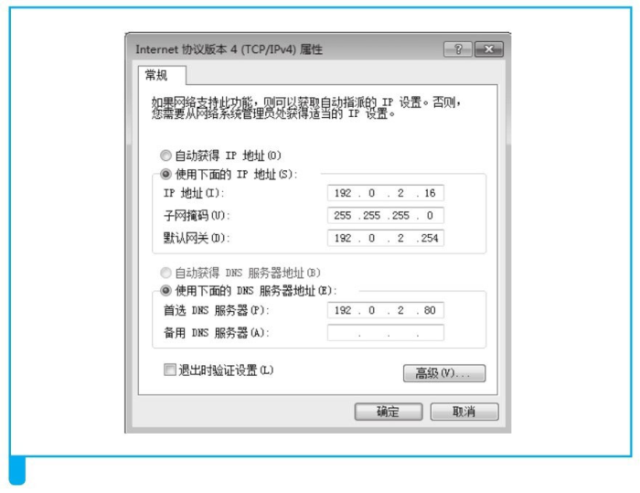

## 1.3 全世界DNS服务器的大接力
### 1.3.1 DNS服务器的基本工作
DNS服务器的基本工作就是接收来自客户端的查询消息，然后根据消息的内容返回响应。
其中，来自客户端的查询消息包含以下3种信息。
（a）域名：服务器、邮件服务器（邮件地址中@后面的部分）的名称。
（b） Class：在最早设计DNS方案时，DNS在互联网以外的其他网络中的应用也被考虑到了，而Class就是用来识别网络的信息。不过，如今除了互联网并没有其他的网络了，因此Class的值永远是代表互联网的IN。
（c）记录类型：表示域名对应何种类型的记录。例如，当类型为A时，表示域名对应的是IP地址；当类型为MX时，表示域名对应的是邮件服务器。对于不同的记录类型，服务器向客户端返回的信息也会不同。

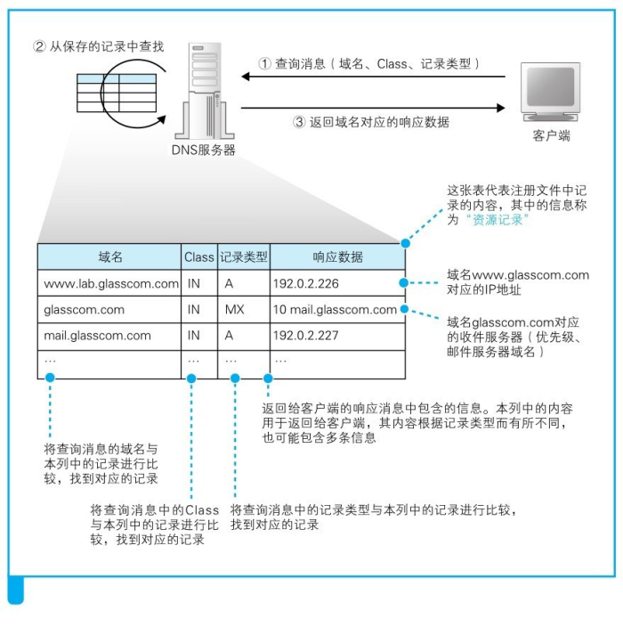

### 1.3.2 域名的层次结构

层次结构能够帮助我们更好地管理大量的信息。
DNS服务器中的所有信息都是按照域名以分层次的结构来保存的。
DNS中的域名都是用句点来分隔的，比如www.lab.glasscom.com，这里的句点代表了不同层次之间的界限，在域名中，越靠右的位置表示其层级越高。

负责管理lab.glasscom.com这个域的DNS服务器的IP地址需要注册到glasscom.com域的DNS服务器中，而glasscom.com域的DNS服务器的IP地址又需要注册到com域的DNS服务器中。

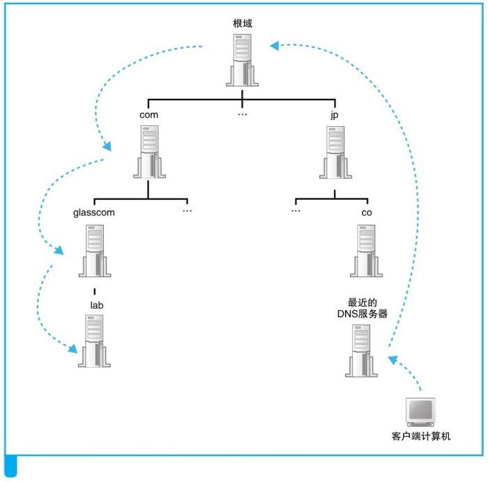

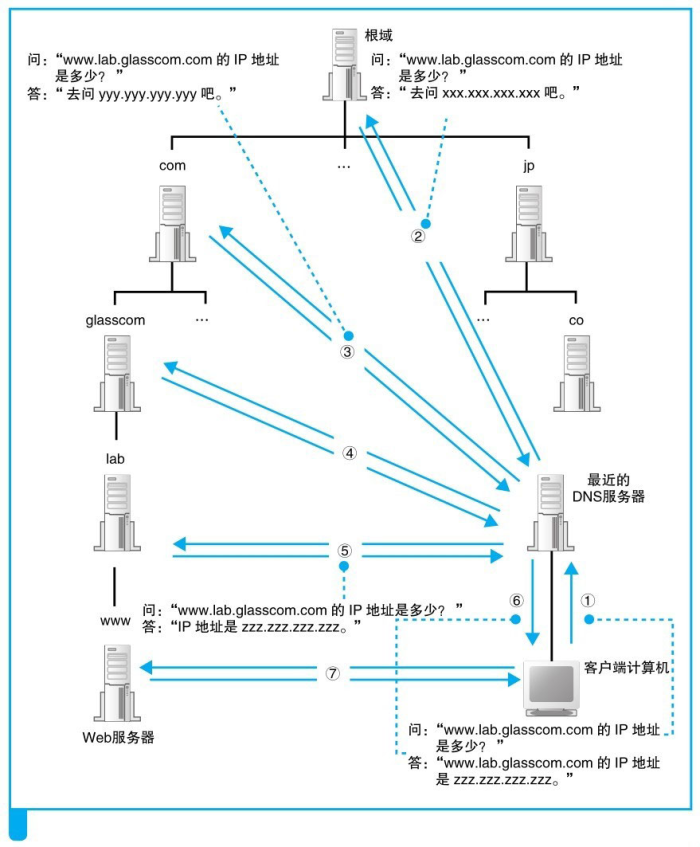

通过缓存加快DNS服务器的响应，不仅缓存域名存在的响应结果还缓存域名不存的响应结果。

DNS服务器中保存的信息都设置有一个有效期，当缓存中的信息超过有效期后，数据就会从缓存中删除。
而且，在对查询进行响应时，DNS服务器也会告知客户端这一响应的结果是来自缓存中还是来自负责管理该域名的DNS服务器。

## 1.4 委托协议栈发送消息
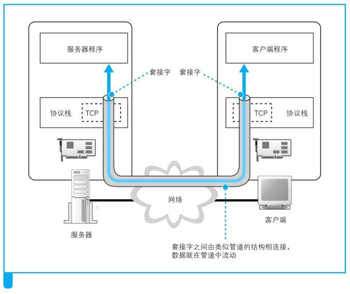

在进行收发数据操作之前，双方需要先建立起这条管道才行。建立管道的关键在于管道两端的数据出入口，这些出入口称为套接字。

服务器一方先创建套接字，然后等待客户端向该套接字连接管道。

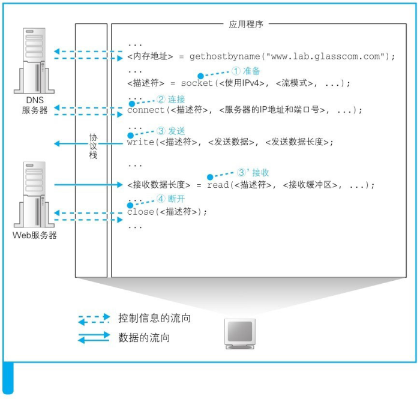

描述符：应用程序用来识别套接字的机制。

IP地址和端口号：客户端和服务器之间用来识别对方套接字的机制。