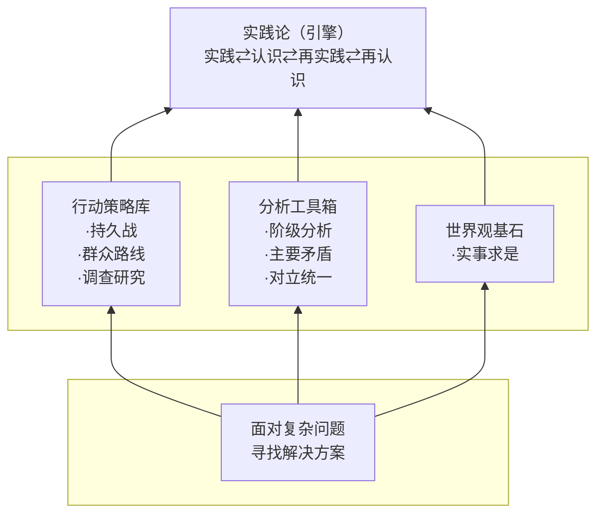
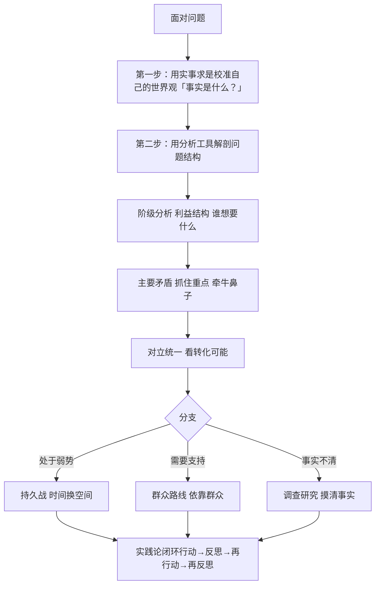
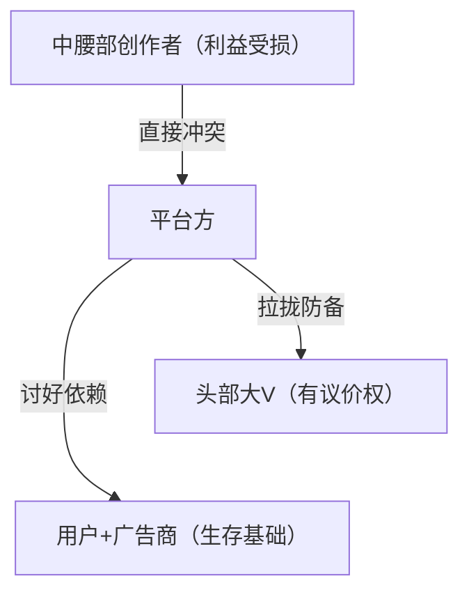
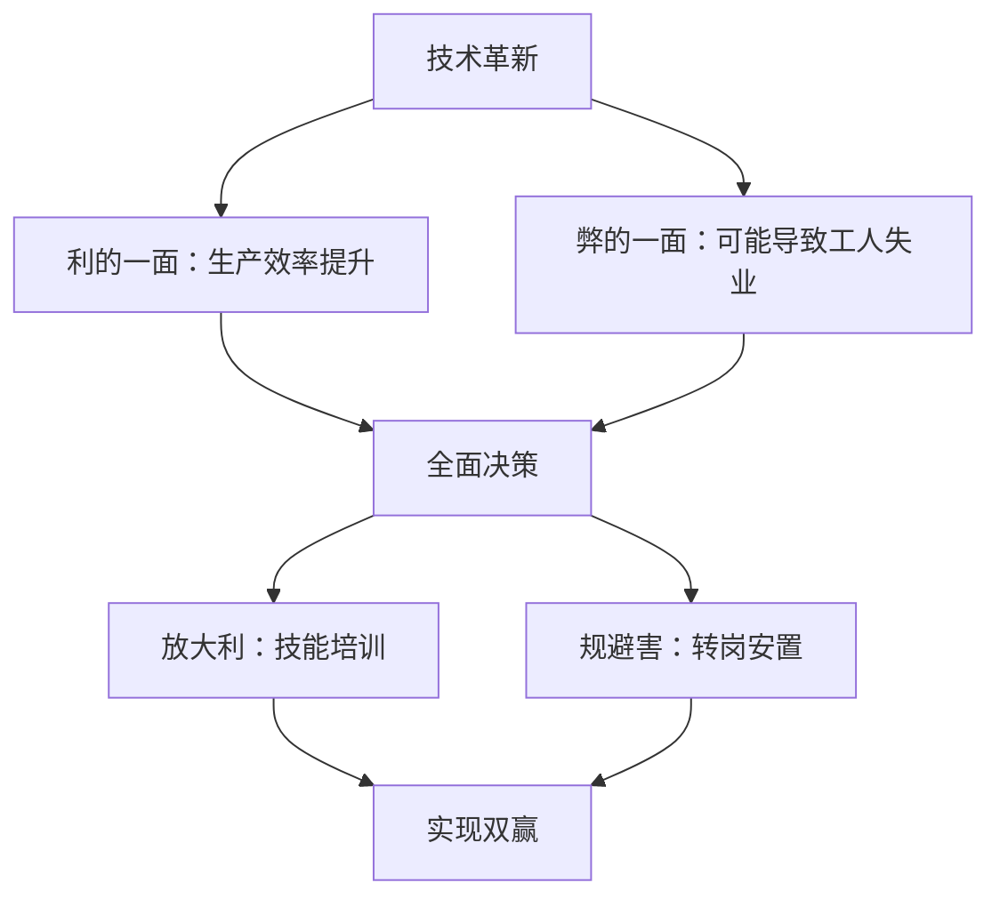
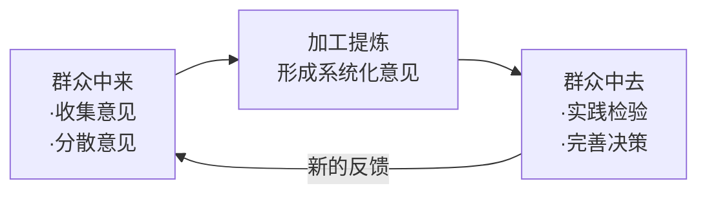

# 毛选的底层逻辑：看透本质的思维框架
> 一套能够穿透表象、直抵问题本质的完整思维体系
>

---

## 目录
+ [前言：为什么需要这套思维框架](#前言)
+ [思维导图与学习路径](#思维导图与学习路径)
+ [思维框架总览](#思维框架总览)
+ [一、实事求是—所有思考的基石](#一-实事求是)
+ [二、阶级分析—解剖世界的利刃](#二-阶级分析)
+ [三、主要矛盾—驾驭复杂的罗盘](#三-主要矛盾)
+ [四、对立统一—世界运动的引擎](#四-对立统一)
+ [五、持久战—以弱胜强的宝典](#五-持久战)
+ [六、群众路线—力量的源泉](#六-群众路线)
+ [七、调查研究—行动的指南针](#七-调查研究)
+ [八、实践论—知行合一的闭环](#八-实践论)
+ [如何内化这套思维框架](#如何内化这套思维框架)

---

## 前言：为什么需要这套思维框架
在这个信息爆炸、问题复杂的时代，我们常常面临这样的困境：

+ **看不清本质**：被表象迷惑，陷入细节纠缠
+ **抓不住重点**：事务繁杂，不知从何下手
+ **理不清关系**：各方博弈，难以洞察利益格局
+ **找不准方向**：面对变局，缺乏战略定力
+ **行不通路径**：理论与实践脱节，方案落地困难

《毛泽东选集》蕴含着一套经过历史检验的思维框架，它不仅指导了一场伟大的革命，更是一套可以迁移到现代工作、生活、管理中的普适性思维工具。

本文将这套思维框架拆解为 **八个核心模块**，帮助你构建看透本质的认知能力。

---

## 思维导图与学习路径
### 八个模块的逻辑关系


### 学习路线图（Roadmap）
```plain
┌─────────────────────────────────────────────────────────────────────────────┐
│                        毛选思维框架学习路线图                                 │
├─────────────────────────────────────────────────────────────────────────────┤
│                                                                             │
│  第一阶段：建立世界观                                                    │
│  ┌─────────────────────────────────────────────────────────────────────┐   │
│  │  📖 实事求是                                                       │   │
│  │  ╌╌╌╌╌╌╌╌╌                                                      │   │
│  │  • 学会区分事实与观点                                              │   │
│  │  • 培养空杯心态，放下预设                                          │   │
│  │  • 深入调查研究，占有全面材料                                      │   │
│  │  • 去粗取精，发现规律                                              │   │
│  │                                                                  │   │
│  │  ✅ 产出：能客观地看待问题，不被主观偏见干扰                       │   │
│  └─────────────────────────────────────────────────────────────────────┘   │
│                                    ↓                                        │
│  第二阶段：掌握分析工具                                                  │
│  ┌─────────────────────────────────────────────────────────────────────┐   │
│  │  🔧 分析工具箱                                                     │   │
│  │  ╌╌╌╌╌╌╌╌╌                                                      │   │
│  │  ┌──────────┐  ┌──────────┐  ┌──────────┐                      │   │
│  │  │阶级分析  │  │主要矛盾  │  │对立统一  │                      │   │
│  │  │看透利益  │  │抓住重点  │  │动态转化  │                      │   │
│  │  └──────────┘  └──────────┘  └──────────┘                      │   │
│  │                                                                  │   │
│  │  ✅ 产出：能解剖复杂问题，找到关键着力点                           │   │
│  └─────────────────────────────────────────────────────────────────────┘   │
│                                    ↓                                        │
│  第三阶段：制定行动策略                                                  │
│  ┌─────────────────────────────────────────────────────────────────────┐   │
│  │  🎯 行动策略库                                                     │   │
│  │  ╌╌╌╌╌╌╌╌╌                                                      │   │
│  │  ┌──────────┐  ┌──────────┐  ┌──────────┐                      │   │
│  │  │持久战    │  │群众路线  │  │调查研究  │                      │   │
│  │  │以弱胜强  │  │力量源泉  │  │摸清事实  │                      │   │
│  │  └──────────┘  └──────────┘  └──────────┘                      │   │
│  │                                                                  │   │
│  │  ✅ 产出：能制定可行的解决方案，整合各方力量                      │   │
│  └─────────────────────────────────────────────────────────────────────┘   │
│                                    ↓                                        │
│  第四阶段：建立持续进化机制                                              │
│  ┌─────────────────────────────────────────────────────────────────────┐   │
│  │  🔄 实践论闭环                                                     │   │
│  │  ╌╌╌╌╌╌╌╌╌                                                      │   │
│  │  • 实践 → 认识 → 再实践 → 再认识                                  │   │
│  │  • 从失败中学习，快速迭代                                          │   │
│  │  • 持续进化，不断提升                                              │   │
│  │                                                                  │   │
│  │  ✅ 产出：建立自我进化系统，持续成长                               │   │
│  └─────────────────────────────────────────────────────────────────────┘   │
│                                                                             │
└─────────────────────────────────────────────────────────────────────────────┘
```

### 模块协作流程图


### 完整应用流程示例
以"推动一项管理改革"为例：

```plain
1️⃣ 实事求是
   ↓
   "改革的真实背景是什么？"（不做预设，深入调查）

2️⃣ 阶级分析
   ↓
   "谁会受益？谁会受损？谁是中间派？"（绘制利益地图）

3️⃣ 主要矛盾
   ↓
   "当前最核心的阻力是什么？"（找到牛鼻子）

4️⃣ 对立统一
   ↓
   "阻力背后有什么机会？如何转化？"（危中寻机）

5️⃣ 调查研究
   ↓
   "深入一线，了解真实情况和诉求"（摸清事实）

6️⃣ 群众路线
   ↓
   "团结支持者，争取中间派，化解阻力"（整合力量）

7️⃣ 持久战
   ↓
   "分阶段推进，积小胜为大胜"（稳步推进）

8️⃣ 实践论
   ↓
   "试点验证，快速迭代，持续优化"（闭环进化）
```

---

## 思维框架总览
### 八大模块关系图
```plain
┌─────────────────────────────────────────────────────────────────┐
│                       思维框架整体架构                           │
├─────────────────────────────────────────────────────────────────┤
│                                                                 │
│    ┌─────────────────────────────────────────────────────┐     │
│    │              实践论（引擎/闭环）                      │     │
│    │         实践→认识→再实践→再认识（螺旋上升）            │     │
│    └──────────────────▲──────────────────────────────────┘     │
│                       │                                         │
│    ┌─────────────────────────────────────────────────────┐     │
│    │            行动策略库（如何解决问题）                  │     │
│    │  ┌──────────┐  ┌──────────┐  ┌──────────┐           │     │
│    │  │持久战    │  │群众路线  │  │调查研究  │           │     │
│    │  │以弱胜强  │  │力量源泉  │  │摸清事实  │           │     │
│    │  └──────────┘  └──────────┘  └──────────┘           │     │
│    └──────────────────▲──────────────────────────────────┘     │
│                       │                                         │
│    ┌─────────────────────────────────────────────────────┐     │
│    │            分析工具箱（如何看问题）                    │     │
│    │  ┌──────────┐  ┌──────────┐  ┌──────────┐           │     │
│    │  │阶级分析  │  │主要矛盾  │  │对立统一  │           │     │
│    │  │利益结构  │  │抓住重点  │  │动态转化  │           │     │
│    │  └──────────┘  └──────────┘  └──────────┘           │     │
│    └──────────────────▲──────────────────────────────────┘     │
│                       │                                         │
│    ┌─────────────────────────────────────────────────────┐     │
│    │              实事求是（基石/世界观）                  │     │
│    │         思想必须与客观现实精准对应                    │     │
│    └─────────────────────────────────────────────────────┘     │
│                                                                 │
└─────────────────────────────────────────────────────────────────┘
```

## 一、实事求是—所有思考的基石
### 1.1 什么是实事求是
> "实事"就是客观存在着的一切事物，"是"就是客观事物的内部联系，即规律性，"求"就是我们去研究。
>

| 要素 | 含义 |
| :---: | :--- |
| **实事** | 客观存在的一切事物 |
| **是** | 事物内部的规律性 |
| **求** | 我们去研究的过程 |


**本质要求**：我们的思想必须与客观现实精准对应。

### 1.2 人脑的倾向性问题
| 大脑倾向 | 表现 | 危害 |
| :--- | :--- | :--- |
| 走捷径 | 依赖直觉、经验做判断 | 可能错失真相 |
| 情绪化 | 被观点煽动，急于站队 | 失去理性判断 |
| 教条化 | 盲目复制成功案例 | 忽视具体条件 |


**举例**：

+ 看到一个商业模式成功 → 急于复制表象 → 忽视其背后的市场环境、用户基础、技术条件
+ 听到耸人听闻的观点 → 立刻站队批判 → 不去求证事实依据、数据来源、逻辑链条

### 1.3 实事求是的三个步骤
```plain
┌─────────────┐      ┌─────────────┐      ┌─────────────┐
│  第一步     │  →   │  第二步     │  →   │  第三步     │
│  放下预设   │      │  深入调查   │      │  加工提炼   │
│  空杯心态   │      │  占有材料   │      │  发现规律   │
└─────────────┘      └─────────────┘      └─────────────┘
     │                    │                    │
     ▼                    ▼                    ▼
 承认自己的无知    全面占有材料      去粗取精、去伪存真
不带偏见观察      既要利也要弊      由此及彼、由表及里
                     既听赞成也听反对
```

#### 第一步：放下预设
培养"空杯心态"的关键：

+ 承认自己的无知
+ 用不带偏见的眼睛观察世界
+ **第一追问**："事实究竟是什么？"而非"我希望事实是什么？"

#### 第二步：深入调查
| 调查要求 | 具体做法 |
| :--- | :--- |
| **深入一线** | 和真实用户聊天，观察使用习惯，听他们抱怨什么 |
| **全面占有** | 不只看报表数字，要了解数字背后的原因 |
| **听取不同声音** | 既看有利一面，也看弊的一面；既听赞成，也听反对 |
| **追溯历史** | 了解事物的来龙去脉 |


**警示**：片面的事实比谎言更具欺骗性，因为它让你以为掌握了真相。

#### 第三步：加工提炼
运用工具：

+ 逻辑分析
+ 比较归纳
+ 系统思考

目标：找出事物内在的、必然的联系（即"是"）

### 1.4 实事求是的三个应用场景
| 场景 | 实事求是的要求 |
| :--- | :--- |
| **个人成长** | 诚实面对优缺点，从真实兴趣和能力出发规划人生，不盲目追逐热门标签 |
| **企业经营** | 深刻洞察产业环境、竞争格局、用户需求，围绕真实价值创造构建商业模式 |
| **社会问题** | 超越情绪化口号和简单道德评判，深入分析结构性成因和利益纠葛 |


---

## 二、阶级分析—解剖世界的利刃
### 2.1 什么是阶级分析
根据人们在某个特定系统中所处的**经济地位**、所拥有的**资源**以及由此产生的**根本利益**，来对人群进行划分，并分析他们之间的相互关系和力量对比。

**核心观点**：驱动人类社会行为的最根本动力，不是抽象的道德、观念或情感，而是实实在在的**利益**。

掌握阶级分析的思维，能让你拥有一双"X光眼"，看透温情脉脉的面纱背后，那些最真实、最坚硬的利益结构。

一个人的态度和言论，并不由他的品德高下决定，而是由他所处的"位置"和他屁股下面的"椅子"决定的。

### 2.2 利益结构的现实例子
**一家公司内的三方博弈**：

| 群体 | 核心利益 | 拥有资源 |
| :--- | :--- | :--- |
| **股东** | 资本回报率、市值增长 | 资本 |
| **管理层** | 职位稳固、薪酬权力提升 | 决策权、信息优势 |
| **基层员工** | 稳定收入、良好环境、技能提升、职业发展 | 劳动力、执行能力 |


**三方关系**：

+ 合作面：公司发展好，大家都受益
+ 矛盾面：提高员工福利 → 减少股东利润；加强管控 → 限制员工自由

### 2.3 阶级分析的操作方法：绘制"利益地图"
面对任何具体问题，在脑中回答以下问题：

| 问题 | 引导思考 |
| :--- | :--- |
| **有哪些角色？** | 识别局中所有参与者 |
| **谁和谁利益一致？** | 可以被划为一类 |
| **各自核心诉求是什么？** | 每个群体真正想要什么 |
| **各自掌握什么资源权力？** | 资本？决策权？信息？劳动力？ |
| **关系如何？** | 相互依存？相互对立？可相互转化？ |


### 2.4 案例分析：互联网平台修改分成规则
**背景**：平台提高对内容创作者的分成门槛

| 利益群体 | 核心利益 | 受影响程度 | 可能反应 |
| :--- | :--- | :--- | :--- |
| **平台方** | 商业利润、市场份额 | 改革发起者 | 用算法推荐等说辞解释合理性 |
| **头部大V** | 流量变现、议价能力 | 有议价能力 | 被拉拢，获得更好条件 |
| **中腰部创作者** | 收入稳定、生存空间 | 利益受损最严重 | 联合抗议，甚至出走 |
| **普通用户** | 内容质量、多样性 | 相对无感 | 关心实际体验 |
| **广告商** | 流量稳定性、投放效果 | 间接影响 | 关注平台流量变化 |


**利益关系图谱**：



**预测结果**：

+ 中腰部创作者联合抗议 → 平台安抚头部大V → 用说辞向用户广告商解释

### 2.5 阶级分析在管理中的应用
**推动改革前的利益分析**：

| 群体分类 | 特征 | 应对策略 |
| :--- | :--- | :--- |
| **坚定支持者** | 改革会让他们获益 | 团结起来，形成改革核心力量 |
| **潜在阻力** | 改革让他们受损或增加不确定性 | 分析担忧（怕失权？怕改变习惯？），针对性化解或孤立顽固者 |
| **中间摇摆派** | 利益不明确 | 用改革前景和实际利益争取 |


**经典策略**：团结朋友 → 分化敌人 → 争取中间

---

## 三、主要矛盾—驾驭复杂的罗盘
### 3.1 为什么需要"主要矛盾"思维
通过实事求是和阶级分析后，我们往往发现：

+ 各种矛盾犬牙交错、盘根错节
+ 千头万绪摆在面前，不知从何处着手
+ 容易陷入"眉毛胡子一把抓"的困境

**解决方案**：找到那个"牵一发而动全身"的**主要矛盾**。

### 3.2 什么是主要矛盾
| 判断标准 | 说明 |
| :--- | :--- |
| **唯一标准** | 哪个矛盾的存在和发展，**规定或影响了**其他矛盾的存在和发展 |
| **形象比喻** | "牛鼻子"——牵住它，整个系统就活了 |


### 3.3 历史案例：抗日战争时期的主要矛盾分析
| 矛盾类型 | 具体矛盾 | 是否为主要矛盾 | 原因 |
| :--- | :--- | :---: | :--- |
| 民族矛盾 | 中华民族 vs 日本帝国主义 | ✅ 是 | 威胁整个民族生存，尖锐性压倒一切 |
| 阶级矛盾 | 地主 vs 农民 | ❌ 否 | 服从于民族矛盾的大局 |
| 阶级矛盾 | 资产阶级 vs 无产阶级 | ❌ 否 | 服从于民族矛盾的大局 |
| 派系矛盾 | 国民党内部不同派系 | ❌ 否 | 次要矛盾 |


**战略决策**：停止内战，一致对外 → 建立抗日民族统一战线  
**战略思维**：把解决次要矛盾（如土地革命）暂时服从于解决主要矛盾

### 3.4 高手与普通人的精力分配
```plain
普通人：                    高手：
┌─────────────────┐        ┌─────────────┐
│ 精力分散到所有事 │        │ 80%精力     │
│                 │        │ 聚焦核心20% │
│ ████████▓▓▓▓▓▓▓│        │ ████████    │
└─────────────────┘        └─────────────┘
    被100%事务拖垮            解决核心问题
                              其他迎刃而解
```

### 3.5 个人成长中的主要矛盾识别
| 阶段/情境 | 可能的短板 | 如何判断哪个是主要矛盾 |
| :--- | :--- | :--- |
| 职业新人 | 拖延、表达不强、专业知识不足、人脉不广 | 哪个短板**最限制当前发展**？ |
| 团队管理 | 执行力不强、沟通不畅、目标不清 | 深挖：表面是执行力，实际是**目标缺乏共识**？ |
| 企业经营 | 资金紧张、人才缺乏、产品同质化 | 哪个问题不解决，其他问题都无法推进？ |


**团队问题案例**：

| 分析维度 | 内容 |
| :--- | :--- |
| **表面问题** | 执行力不强 |
| **深层问题** | 团队成员对目标缺乏共识，不知道为何而战 |
| **主要矛盾** | 战略共识缺失 |
| **错误做法** | 抓考勤、抓KPI（在次要矛盾上用功） |
| **正确做法** | 开战略共识会，解决"为何而战"（抓住主要矛盾） |


### 3.6 识别主要矛盾的能力要求
| 能力 | 说明 |
| :--- | :--- |
| **深刻洞察力** | 不能只看表面，要挖深层原因 |
| **全局观** | 不能只看树木，要见森林 |
| **长远眼光** | 不能只看眼前，要谋长远 |


### 3.7 与其他思维的关系
```plain
实事求是 → 占有全面真实的材料
    ↓
阶级分析 → 认清局中各种角色和利益关系
    ↓
主要矛盾 → 从复杂中找到决定全局的"牛鼻子"
```

> 抓住主要矛盾的过程，本身就是一个不断深化认识、逼近事物本质的过程。
>

---

## 四、对立统一—世界运动的引擎
### 4.1 什么是对立统一法则
任何矛盾的双方：

+ **对立**：相互排斥、相互斗争
+ **统一**：相互依存、相互联结，并在一定条件下可以相互转化

这是世界运动变化的**根本规律**，所有矛盾运动的**内在引擎**。它让我们超越了非黑即白的线性思维，进入了一个充满可能性和转化空间的辩证世界。

任何危机的背后都潜藏着转机，任何强大的对手身上都存在着可以被利用的弱点。

### 4.2 对立的绝对性：斗争无处不在
| 层面 | 对立的表现 |
| :--- | :--- |
| **人体内部** | 细胞生长与凋亡始终斗争 |
| **市场交易** | 买方希望低价 vs 卖方希望高价 |
| **团队管理** | 追求创新 vs 维持稳定 |
| **组织发展** | 变革动力 vs 守成阻力 |


**启示**：

+ 斗争是事物生机与活力的来源
+ 没有矛盾斗争的组织 = 一潭死水 → 离消亡不远
+ **敢于承认矛盾、正视矛盾、甚至欢迎矛盾** → 它是变革和进步的信号

### 4.3 统一的两个方面
#### 4.3.1 相互依存
矛盾的双方，谁也离不开谁：

| 对立统一 | 说明 |
| :--- | :--- |
| 黑暗 ↔ 光明 | 没有黑暗，无所谓光明 |
| 失败 ↔ 成功 | 没有失败，无所谓成功 |
| 风险 ↔ 收益 | 没有风险，没有收益 |
| 生产 ↔ 销售 | 没有销售，生产无意义；没有生产，销售是空中楼阁 |


**企业案例**：

+ 生产部门抱怨销售预测不准
+ 销售部门抱怨生产交期太慢
+ 但双方唇亡齿寒 → 解决矛盾不是消灭某一方，而是达成更高水平的平衡

#### 4.3.2 相互转化
**在一定的条件下**，矛盾的双方可以向对立面转化：

| 转化可能 | 条件 |
| :--- | :--- |
| 劣势 → 优势 | 发挥自身优势，创造有利条件 |
| 危机 → 机遇 | 冷静分析，找到突破口 |
| 失败 → 成功 | 总结经验，调整策略 |
| 被领导者 → 领导者 | 积累实力，把握时机 |


> "福兮祸所伏，祸兮福所倚"
>

### 4.4 对立统一的立体视角
| 传统线性思维 | 对立统一的辩证思维 |
| :--- | :--- |
| 非黑即白 | 一分为二 |
| 静止孤立 | 动态联系 |
| 单一维度 | 多维立体 |
| 要么全好要么全坏 | 利弊共存、可以转化 |


### 4.5 应用举例：技术革新的全面决策


### 4.6 对立统一法则的思维要求
| 要求 | 说明 |
| :--- | :--- |
| **全局观** | 不能只看一面，要看矛盾的双方 |
| **发展观** | 不能静止看问题，要看双方力量消长和转化可能 |
| **条件观** | 积极创造促使矛盾向有利方向转化的条件 |


---

## 五、持久战—以弱胜强的宝典
### 5.1 持久战解决什么问题
当你处于**弱势地位**时：

+ 小公司面对行业巨头
+ 初出茅庐的年轻人追赶资深前辈
+ 谈判中筹码远少于对手

**核心思想**：反对速胜论的盲动和亡国论的悲观，主张在客观认识敌我优劣的基础上，通过发挥主观能动性，打一场有计划、有步骤、以时间换空间的持久战。

### 5.2 持久战的三个思维精髓
#### 5.2.1 客观评估基本条件（SWOT分析）
**中日战争分析示例**：

```plain
┌────────────────────────────────────────────────────────────────┐
│                       敌我双方对比分析                          │
├──────────────────────────────┬─────────────────────────────────┤
│       日本（敌方）            │         中国（我方）            │
├──────────────────────────────┼─────────────────────────────────┤
│ ✅ 优势：                     │ ❌ 劣势：                      │
│   • 强国，武器装备先进        │   • 弱国，技术军力落后         │
│                              │                                 │
│ ❌ 劣势：                     │ ✅ 优势：                      │
│   • 非正义侵略战争            │   • 正义反侵略战争             │
│   • 国内资源有限              │   • 地大物博，人口众多         │
│   • 国际失道寡助              │   • 国际多助                   │
├──────────────────────────────┴─────────────────────────────────┤
│ 结论：                                                          │
│   • 速胜不可能（敌强我弱）                                     │
│   • 亡国不可能（敌小我大、敌退步我进步、敌寡助我多助）          │
└────────────────────────────────────────────────────────────────┘
```

**自我追问**：

+ 对方的强大背后，隐藏着哪些固有的、难以克服的弱点？
+ 自身的弱小之中，又蕴含着哪些可以被利用的、决定未来的优势？

#### 5.2.2 以时间换空间，积小胜为大胜
```plain
┌────────────────────────────────────────────────────┐
│                    持久战策略                       │
├────────────────────────────────────────────────────┤
│                                                    │
│  不要在主要战场与巨头正面决战（以卵击石）           │
│                    ↓                               │
│  选择边缘市场、细分市场作为根据地                   │
│                    ↓                               │
│  在这些领域深耕细作，建立局部优势                   │
│                    ↓                               │
│  积小胜为大胜                                       │
│  - 服务好一个客户 = 一次小胜                        │
│  - 产品小迭代 = 一次小胜                            │
│  - 技术微创新 = 一次小胜                            │
│                    ↓                               │
│  最终实现整体实力的逆转和反攻                       │
│                                                    │
├────────────────────────────────────────────────────┤
│  核心要点：以时间换空间，用持续积累换取质变突破      │
└────────────────────────────────────────────────────┘
```

#### 5.2.3 清晰的阶段论
**三个阶段的战略任务**：

| 阶段 | 战略态势 | 核心任务 | 具体做法 |
| :--- | :--- | :--- | :--- |
| **第一阶段** | 敌之战略进攻   我之战略防御 | 消耗敌人、保存自己 | 避免决战，开展游击战 |
| **第二阶段** | 敌之战略保守   我之准备反攻 | 巩固根据地、积蓄力量 | 发展生产、不断骚扰敌人 |
| **第三阶段** | 我之战略反攻   敌之战略退却 | 集中优势兵力，夺取胜利 | 转入正规战，决战 |


**阶段错位的危害**：

+ 在防御阶段就想反攻 → **冒进**
+ 在反攻阶段还固守防御思维 → **保守**

### 5.3 持久战思维的应用：职业生涯规划
| 职业阶段 | 对应战争阶段 | 核心任务 |
| :--- | :--- | :--- |
| **刚入职场** | 防御阶段 | 学习、适应、积累经验，不要好高骛远 |
| **工作三五年** | 相持阶段 | 在专业方向深耕，建立核心竞争力，形成个人品牌 |
| **时机成熟** | 反攻阶段 | 争取更高职位，或独立创业 |


### 5.4 持久战的智慧总结
| 告诫 | 内容 |
| :--- | :--- |
| **关于耐心** | 不要妄想一夜暴富、一战成名，要做"难而正确"的事 |
| **关于困难时** | 给予坚持下去的勇气和方法 |
| **关于顺利时** | 提醒保持清醒和谦逊 |
| **关于成长** | 任何事物的成长壮大，都需经历从量变到质变的过程 |


> 任何事物的成长壮大，都不是一蹴而就的，都必须经历一个从量变到质变的过程。
>

---

## 六、群众路线—力量的源泉
### 6.1 什么是群众路线
**经典表述**：从群众中来，到群众中去



### 6.2 "从群众中来"：决策和创新的起点
| 要求 | 具体做法 |
| :--- | :--- |
| **放下架子** | 深入实践第一线 |
| **明确"群众"是谁** | 用户、客户、基层员工、社区居民 |
| **收集真实需求** | 从他们的实践经验、零散意见中提炼 |


**注意**：

+ 群众的意见往往是朴素的、具体的、相互矛盾的
+ 不能简单搞"意见统计学"（哪个声音大就听哪个）
+ 要透过现象，洞察背后共同的、本质的需求

**加工过程**：把分散的、不成系统的意见，通过大脑加工，变成集中的、系统的意见和办法

+ 就像把零散矿石，经过熔炉冶炼，提炼出精纯的钢铁

### 6.3 "到群众中去"：检验和完善的必经之路
| 步骤 | 内容 |
| :--- | :--- |
| **宣传解释** | 把决策逻辑和目标清晰告诉他们，让他们明白"为什么" |
| **实践检验** | 这些来自实践一线的反馈，是检验决策正确与否的唯一标准 |
| **发现新问题** | 收集新的、更丰富的意见 |


### 6.4 螺旋式上升的进化过程
```plain
                    第3次循环……（持续深化）
                              ▲
                              │
                    认识深化，决策完善，联系紧密
                              │
                    第2次循环：集中分析 → 优化系统 → 再到群众中去
                              ▲
                              │
                    发现新问题，收集新意见
                              │
        第1次循环：从群众中来 → 到群众中去
```

**每一次循环**：

+ 认识就深化一步
+ 决策就完善一步
+ 与群众的联系就紧密一步
+ 事业就前进一步

### 6.5 群众路线与现代管理
| 领域 | "群众"是谁 | 群众路线的体现 |
| :--- | :--- | :--- |
| **互联网产品** | 用户 | 用户中心、开放、迭代 |
| **团队管理** | 基层员工 | 倾听、激发集体智慧、赋能而非管控 |
| **政府治理** | 市民 | 民生导向、公众参与、政策反馈 |


**互联网精神的本质**：用户中心、开放、迭代 = 群众路线在商业领域的体现

### 6.6 群众路线与实践论的关系
> 这个闭环，完美地体现了《实践论》的精髓：实践、认识、再实践、再认识。
>

---

## 七、调查研究—行动的指南针
### 7.1 为什么强调调查研究
在信息唾手可得、人人都是"麦克风"的今天：

+ **"喷子文化"**：没有充分了解就轻率发表意见
+ **"键盘侠现象"**：缺乏调查研究的精神和能力

> 没有调查，就没有发言权
>

### 7.2 调查研究的四个要点
| 要点 | 要求 | 具体做法 |
| :--- | :--- | :--- |
| **1. 明确目的性** | 为了解决问题 | 开始前在脑子里有清晰的"问题意识"：要解决什么？假设是什么？想验证什么？ |
| **2. 深入系统性** | 全面而非片面 | 调查一个面而非一个点；访谈各类对象（客户、竞争对手、供应商、专家、离场者）；了解历史、地理、技术、产业链 |
| **3. 结构分析** | 核心是做阶级分析 | 分析有哪些利益群体？各自的经济状况、政治态度、生活方式？谁是朋友/敌人/中间派？ |
| **4. 边调查边宣传** | 调查本身是宣传组织群众的过程 | 提问方式、关注点、交流态度都在潜移默化地影响他们 |


### 7.3 避免"盲人摸象"式的片面结论
```plain
┌─────────────────────────────────────────────────────┐
│                   全面调查研究                       │
├─────────────────────────────────────────────────────┤
│                                                     │
│                     ┌── 目标客户 ──┐              │
│                    ╱  │             │  ╲           │
│                  ╱    │      供应商  │    ╲         │
│      竞争对手 ───┼─────┼───────┼──────┼── 行业专家 │
│                  ╲    │      离场者  │    ╲         │
│                    ╲  │             │  ╲           │
│                     └── 历史演变 ───┘              │
│           地理分布      技术构成      产业链关系      │
│                                                     │
│         构建立体、全景式的认知                      │
│                                                     │
└─────────────────────────────────────────────────────┘
```


### 7.4 调查研究与阶级分析的结合
**市场调查中的"阶级分析"**：

| 用户类型 | 分析维度 |
| :--- | :--- |
| **核心用户** | 画像、需求、行为模式 |
| **普通用户** | 画像、需求、行为模式 |
| **潜在用户** | 画像、需求、行为模式 |
| **流失用户** | 流失原因、去向 |


### 7.5 决策前的自我追问
| 问题 | 回答要求 |
| :--- | :--- |
| 我做了充分的调查吗？ | 基于事实而非道听途说 |
| 我的结论来源是什么？ | 一手、全面的事实 vs 主观臆断 |
| 我是否深入到了内部结构？ | 了解系统而非表面现象 |


---

## 八、实践论—知行合一的闭环
### 8.1 实践论的核心观点
#### 8.1.1 认识来源于实践
| 观点 | 说明 |
| :--- | :--- |
| 认识的来源 | 改造客观世界的社会实践活动 |
| 非来源 | 头脑固有、神灵启示 |
| 例子 | 婴儿通过触摸、品尝、摔打建立认知 |


#### 8.1.2 认识指导实践并接受检验
```plain
┌─────────────────────────────────────────────────────────┐
│                   实践-认识循环                         │
├─────────────────────────────────────────────────────────┤
│                                                         │
│  ┌────────┐    ┌────────┐    ┌────────┐    ┌────────┐ │
│  │ 实践   │ →  │ 认识   │ →  │ 再实践 │ →  │ 再认识 │ │
│  │ 获得感 │    │ 上升为 │    │ 检验   │    │ 深化   │ │
│  │ 性认识 │    │ 理性   │    │ 理论   │    │ 理论   │ │
│  └────────┘    └────────┘    └────────┘    └────────┘ │
│       ↑                            ↓                    │
│       └────────────────────────────┘                    │
│                  持续循环，螺旋上升                      │
│                                                         │
└─────────────────────────────────────────────────────────┘
```

### 8.2 案例分析：新产品开发
| 阶段 | 实践内容 | 认识成果 |
| :--- | :--- | :--- |
| **第一次实践** | 市场调查、用户访谈 | 获得用户需求的感性认识 |
| **第一次认识** | 分析归纳，设计原型和商业计划书 | 形成理性认识（理论/方案） |
| **第二次实践** | 投放MVP，小部分用户使用 | 收集反馈，检验认识 |
| **第二次认识** | 根据反馈修正设计、优化策略 | 更新认识 |
| **第三次实践** | 推出新版本接受检验 | ... |


**循环往复**：每次循环 → 产品迭代一次 → 对市场理解深刻一层

### 8.3 实践论反对的两种错误倾向
| 错误倾向 | 表现 | 危害 | 正确态度 |
| :--- | :--- | :--- | :--- |
| **"知易行难"的畏缩** | 想太多、做太少，想等所有问题想清楚再开始 | 陷入"分析瘫痪"，永远迈不出第一步 | 不可能行动前掌握全部真理，**敢于实践、敢于试错** |
| **"经验主义"的保守** | 满足于过去成功经验，当成放之四海而皆准的真理 | 当条件变化，老经验变新障碍 | 持续投身新实践，**不断学习更新认知** |


### 8.4 实践论的行动哲学
| 观念 | 对比 |
| :--- | :--- |
| 传统观念 | 追求"一次就做对"的文化 |
| 实践论观念 | 鼓励探索、容忍失败、快速学习、持续改进的文化 |


**如何看待错误**：

| 态度 | 视角 |
| :--- | :--- |
| 不要害怕犯错 | 错误是最宝贵的财富 |
| 以最深刻的方式 | 告诉我们现实世界究竟是怎样的 |
| 每次失败 | 都是一次逼近真理的尝试 |


### 8.5 实践论的价值
> 把每一次行动都看作是一次探索，把每一次结果都看作是一次反馈，把每一次反思都看作是一次成长。
>

> 当你真正掌握了实践、认识、再实践这个循环的奥秘，你就拥有了持续进化的强大引擎，可以在任何未知的领域，通过自己的行动，开辟出一条通往真理和成功的道路。
>

---

## 如何内化这套思维框架
### 思维框架的内在逻辑链条
```plain
┌─────────────────────────────────────────────────────────────┐
│                    四步逻辑链条                              │
├─────────────────────────────────────────────────────────────┤
│                                                             │
│  第一步：世界观的校准                                        │
│  ┌─────────────────────────────────────────────────────┐   │
│  │ 实事求是—清空预设，尊重客观事实                      │   │
│  │ 第一反应："事实是什么？"而非"我觉得怎样？"            │   │
│  └─────────────────────────────────────────────────────┘   │
│                          │                                  │
│                          ▼                                  │
│  第二步：解剖现实的工具箱                                    │
│  ┌────────────┐  ┌────────────┐  ┌────────────┐          │
│  │ 阶级分析   │  │ 主要矛盾   │  │ 对立统一   │          │
│  │ 理清角色   │  │ 找出牛鼻子 │  │ 动态转化   │          │
│  │ 利益关系   │  │ 聚焦重点   │  │ 看到可能   │          │
│  └────────────┘  └────────────┘  └────────────┘          │
│                          │                                  │
│                          ▼                                  │
│  第三步：制定战略和策略的罗盘                                │
│  ┌────────────┐  ┌────────────┐  ┌────────────┐          │
│  │ 持久战     │  │ 群众路线   │  │ 调查研究   │          │
│  │ 以时间换   │  │ 力量源泉   │  │ 贯穿始终   │          │
│  │ 空间       │  │ 血肉联系   │  │ 摸清事实   │          │
│  └────────────┘  └────────────┘  └────────────┘          │
│                          │                                  │
│                          ▼                                  │
│  第四步：推动一切运转的引擎                                    │
│  ┌─────────────────────────────────────────────────────┐   │
│  │ 实践论—实践-认识-再实践的闭环                         │   │
│  │ 从静态模型 → 能够自我进化、螺旋上升的动态系统          │   │
│  └─────────────────────────────────────────────────────┘   │
│                                                             │
└─────────────────────────────────────────────────────────────┘
```

### 思维检查清单
遇到任何挑战时，用以下问题引导思考：

#### 1. 关于事实（实事求是）
| 问题 | 引导思考 |
| :--- | :--- |
| 关于这件事，我掌握的客观事实有哪些？ | 区分事实与观点 |
| 哪些是事实，哪些是我的观点或别人的猜测？ | 保持清醒认知 |
| 为了搞清楚事实，我还需要去做哪些调查研究？ | 明确下一步行动 |


#### 2. 关于结构（阶级分析）
| 问题 | 引导思考 |
| :--- | :--- |
| 这件事涉及到了哪些人或哪些群体？ | 识别参与者 |
| 他们的核心利益分别是什么？ | 理解驱动力 |
| 他们之间是合作、竞争还是对立关系？ | 判断关系类型 |
| 谁是我的朋友，谁是我的对手，谁是可以争取的中间力量？ | 明确站位 |


#### 3. 关于焦点（主要矛盾）
| 问题 | 引导思考 |
| :--- | :--- |
| 在当前阶段，所有问题中最关键、最核心的问题是什么？ | 找核心问题 |
| 解决了哪个问题，其他问题就能迎刃而解？ | 找杠杆点 |
| 我应该把我的主要精力投入到哪里？ | 明确优先级 |


#### 4. 关于动态（对立统一）
| 问题 | 引导思考 |
| :--- | :--- |
| 这件事的利和弊分别是什么？ | 全面分析 |
| 我当前的优势里潜藏着哪些风险？ | 居安思危 |
| 我当前的劣势中又蕴含着哪些机会？ | 转危为机 |
| 有没有可能让不利的因素向有利的方向转化？需要创造什么条件？ | 主动作为 |


#### 5. 关于策略（持久战/群众路线）
| 问题 | 引导思考 |
| :--- | :--- |
| 我的长期目标是什么？ | 明确方向 |
| 当前我处于哪个阶段？ | 判断阶段 |
| 我应该采取什么样的策略，是该防御积累，还是该主动进攻？ | 选择策略 |
| 我需要依靠谁的力量来实现目标？ | 识别力量来源 |
| 我如何去倾听他们的声音，获得他们的支持？ | 建立联结 |


#### 6. 关于行动（实践论）
| 问题 | 引导思考 |
| :--- | :--- |
| 为了验证我的想法，我能做的最小成本的实践是什么？ | 设计MVP |
| 我应该如何设计我的行动方案，以便能最快地获得反馈？ | 快速迭代 |
| 我从上一次的行动（或失败）中学到了什么？ | 复盘总结 |


### 思维框架对人格的塑造
| 思维模块 | 塑造的品质 |
| :--- | :--- |
| **实事求是** | 谦逊、诚实、勇于面对不愿承认的现实 |
| **阶级分析** | 对人性的深刻洞察、通透、包容 |
| **主要矛盾** | 决断力、战略定力 |
| **对立统一** | 在变局中保持乐观和弹性的智慧 |
| **持久战** | 耐心、韧性 |
| **群众路线** | 倾听、共情 |
| **调查研究** | 严谨、务实的工作作风 |
| **实践论** | 直面失败、从头再来的勇气 |


### 结语
> 你能够比别人更快地看透事物的本质，更准确地预测事物的走向，更有效地找到解决问题的杠杆点。
>

这套思维框架的价值在于：

+ **不是**增加一些谈资或者显得高深
+ **而是**要真正地把它内化于心，成为观察世界、解决问题的本能
+ **进而**外化于行，成为日常工作和生活的行为准则

**内化于心，外化于行**——这就是学习这套思维框架的最终目的。

---

## 附录：快速参考卡片
### 思维框架速查表
| 模块 | 核心口诀 | 第一反应问题 |
| :--- | :--- | :--- |
| 实事求是 | 事实胜于观点 | 事实到底是什么？ |
| 阶级分析 | 利益决定立场 | 谁想要什么？ |
| 主要矛盾 | 牵牛鼻子 | 哪个问题解决，其他都解决？ |
| 对立统一 | 危中有机 | 好的坏的各是什么？如何转化？ |
| 持久战 | 积小胜为大胜 | 当前该防御还是进攻？ |
| 群众路线 | 力量在人民 | 我依靠谁？如何获得支持？ |
| 调查研究 | 摸清再说话 | 我掌握多少一手事实？ |
| 实践论 | 做中学 | 最小成本实践是什么？ |


---

**整理说明**：本文基于《毛选的底层逻辑：看透本质的思维框架》一书的摘抄笔记整理而成。在AI辅助下，通过结构化梳理、图表可视化等方式，将原著的核心思想以更清晰、更有条理的方式呈现，便于学习和应用。

